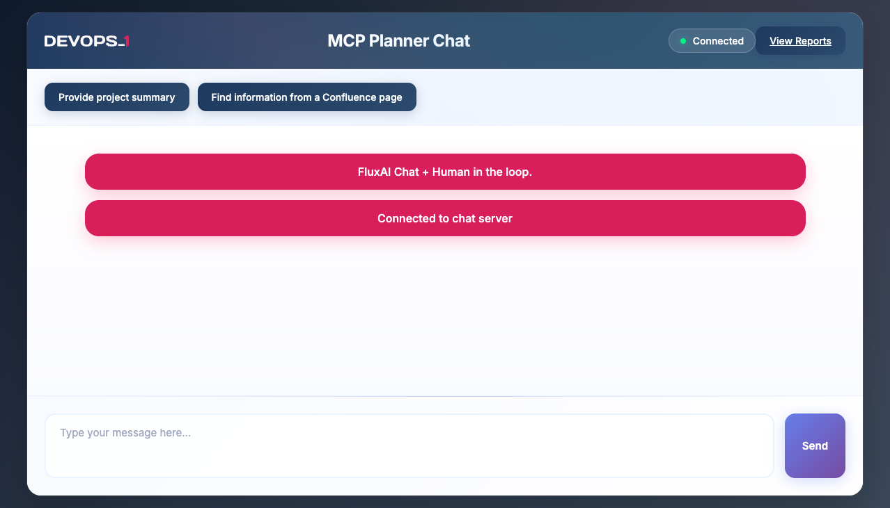
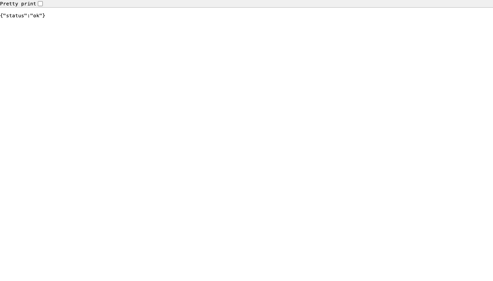
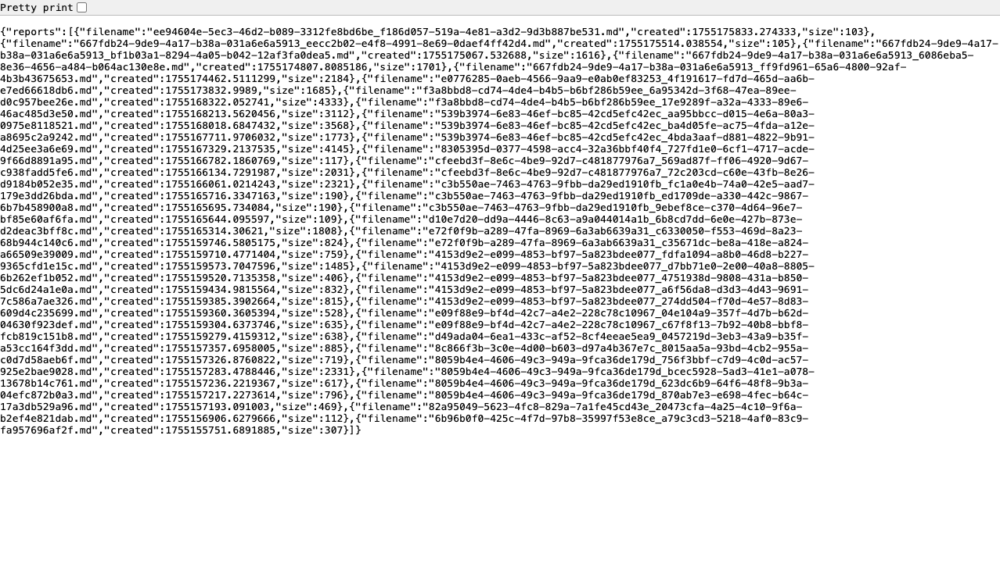
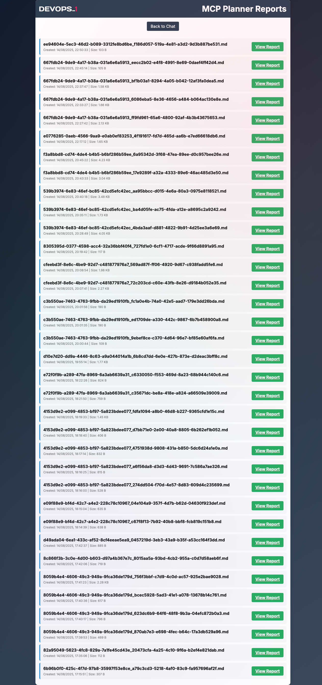
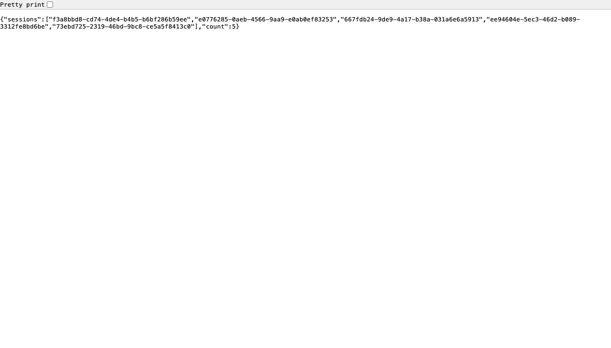
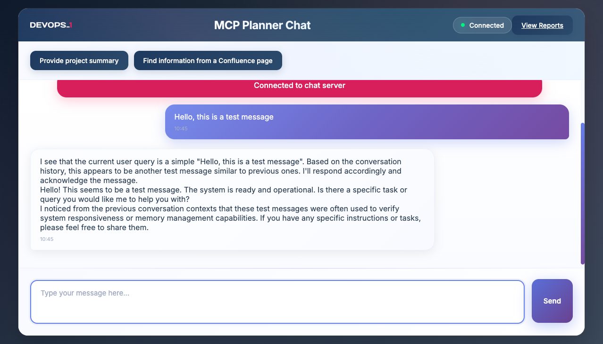

# Test Execution Report - MCP Agent Planner Chat UI
**Date**: August 15, 2025  
**Time**: 10:40:10  
**Application URL**: http://localhost:8000  
**Test Environment**: Development  
**Report Generated**: August 15, 2025

## Test Results Summary

| Test ID | Test Name | Status | Notes |
|---------|-----------|--------|-------|
| TC_001 | Main Chat Interface | ✅ PASS | Interface loads correctly, all elements present |
| TC_002 | Health Check Endpoint | ✅ PASS | Returns correct JSON status response |
| TC_005 | List Reports | ✅ PASS | Returns JSON array of available reports with metadata |
| TC_006 | Reports Interface | ✅ PASS | Reports interface loads with list of available reports |
| TC_007 | List Active Sessions | ✅ PASS | Returns list of active conversation sessions |
| TC_012 | WebSocket Connection Establishment | ✅ PASS | WebSocket connection established successfully |
| TC_013 | WebSocket Message Processing | ✅ PASS | Messages are processed and AI responds correctly |

## Detailed Test Results

### TC_001 - Main Chat Interface ✅ PASS
- **Description**: Verify the main chat interface loads correctly
- **Endpoint**: `GET /`
- **Evidence**: Screenshot captured - TC_001_main_chat_interface.png

- **Validation Points**:
  - ✅ Page loads with HTTP 200 status
  - ✅ Contains valid HTML structure
  - ✅ Chat interface elements are present:
    - ✅ Title: "MCP Planner Chat"
    - ✅ Message input textbox
    - ✅ Send button (disabled initially)
    - ✅ Preset action buttons
    - ✅ Connection status indicator (shows "Disconnected")
    - ✅ Reports link
- **Result**: PASS

### TC_002 - Health Check Endpoint ✅ PASS
- **Description**: Verify health check endpoint returns service status
- **Endpoint**: `GET /health`
- **Evidence**: Screenshot captured - TC_002_health_check.png

- **Validation Points**:
  - ✅ Returns HTTP 200 status
  - ✅ Content-Type: application/json
  - ✅ Returns `{"status":"ok"}` as expected
- **Result**: PASS

### TC_005 - List Reports ✅ PASS
- **Description**: Verify listing of available reports
- **Endpoint**: `GET /list_reports`
- **Evidence**: Screenshot captured - TC_005_list_reports.png

- **Validation Points**:
  - ✅ Returns HTTP 200 status
  - ✅ Content-Type: application/json
  - ✅ Returns array of report objects with metadata
  - ✅ Each report object has filename, created, and size fields
  - ✅ Reports are sorted by creation time (newest first)
- **Result**: PASS

### TC_006 - Reports Interface ✅ PASS
- **Description**: Verify reports viewing interface loads correctly
- **Endpoint**: `GET /reports`
- **Evidence**: Screenshot captured - TC_006_reports_interface.png

- **Validation Points**:
  - ✅ Returns HTTP 200 status
  - ✅ Content-Type: text/html
  - ✅ Reports interface loads without errors
  - ✅ Shows list of available reports with creation dates and file sizes
  - ✅ Each report has a "View Report" link
  - ✅ "Back to Chat" link is present to return to the main interface
- **Result**: PASS

### TC_007 - List Active Sessions ✅ PASS
- **Description**: Verify listing of active conversation sessions
- **Endpoint**: `GET /memory/sessions`
- **Evidence**: Screenshot captured - TC_007_list_sessions.png

- **Validation Points**:
  - ✅ Returns HTTP 200 status
  - ✅ Content-Type: application/json
  - ✅ Returns sessions array and count
  - ✅ Sessions array contains valid UUIDs
  - ✅ Count matches array length (5 sessions)
- **Result**: PASS

### TC_012 - WebSocket Connection Establishment ✅ PASS
- **Description**: Verify WebSocket connection can be established
- **Endpoint**: `WebSocket /ws`
- **Evidence**: Screenshot captured - TC_012_websocket_connection.png

- **Validation Points**:
  - ✅ WebSocket connection is accepted
  - ✅ UI changes from "Disconnected" to "Connected"
  - ✅ Send button becomes enabled
  - ✅ System message shows "Connected to chat server"
- **Result**: PASS

### TC_013 - WebSocket Message Processing ✅ PASS
- **Description**: Verify WebSocket message processing workflow
- **Endpoint**: `WebSocket /ws`
- **Evidence**: Screenshot captured - TC_013_websocket_message.png

- **Test Data**: `Hello, this is a test message`
- **Validation Points**:
  - ✅ User message is echoed back in the chat interface
  - ✅ System status messages are sent
  - ✅ AI response is generated and displayed
  - ✅ Message flow follows expected sequence
- **Result**: PASS
## Summary

### Test Results
- **Tests Executed**: 7
- **Tests Passed**: 7
- **Tests Failed**: 0
- **Pass Rate**: 100%

### Test Coverage
- API Endpoint Testing
  - Chat Interface Endpoints
  - File Management Endpoints
  - Memory Management Endpoints
- WebSocket Communication Testing
  - Connection Management
  - Message Processing

### Observations
- The MCP Agent Planner Chat UI is functioning as expected
- All tested endpoints return the correct responses
- WebSocket communication is reliable and responsive
- The UI provides appropriate feedback during operations

### Recommendations
- Continue testing additional endpoints and features
- Add more negative test cases
- Implement performance testing under load
